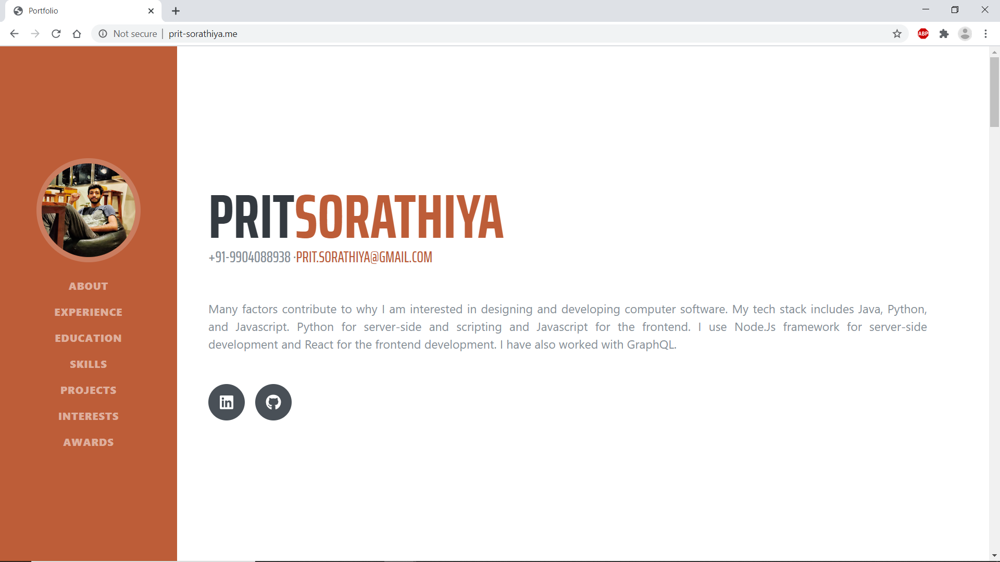

# Portfolio
## Built using React and tools from GitHub Student Developer Pack.

This is a tutorial on building a portfolio website using React and tools from the GitHub Student Developer Pack. Tools used from the **GitHub Student Developer Pack** are **Heroku**, **Namecheap** and **GitHub**.  

The hosted version of this repository is live at [http://prit-sorathiya.me/](http://prit-sorathiya.me/)

## Steps to run locally
1. Clone the repository using `https://github.com/pritsorathiya5181/pritsorathiya5181.github.io.git`
2. `cd` into the cloned repository's ProjectFolder. (i.e. cd pritsorathiya5181.github.io/ProjectFolder - this example only for windows user).
3. run `yarn or npm install`. This will install all the dependencies required for the project.
3. Run the server using `yarn start`.
4. Create your own portfolio by editing the `profileData.json` present in the `src` directory.
5. Place your image in `Assets` directory present inside `src` directory. Make sure to rename it to `profile.jpg` or else you can edit the filename in `import` statement of `Sidebar.js` Component.
6. Change `homepage URL` in package.JSON file with your **hosting URL**.
